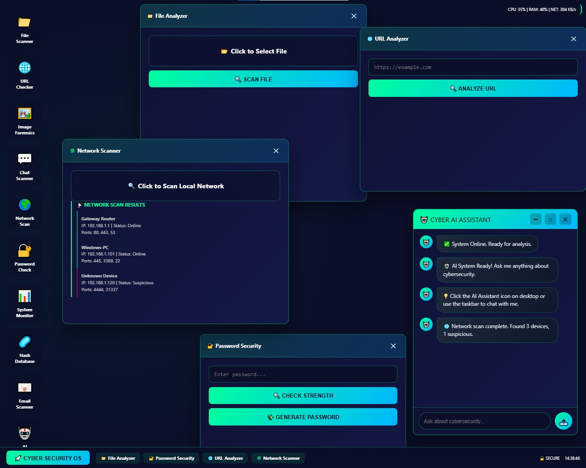
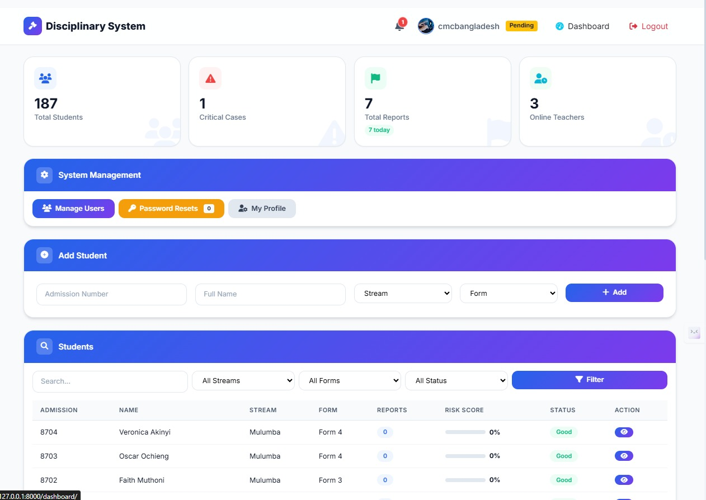
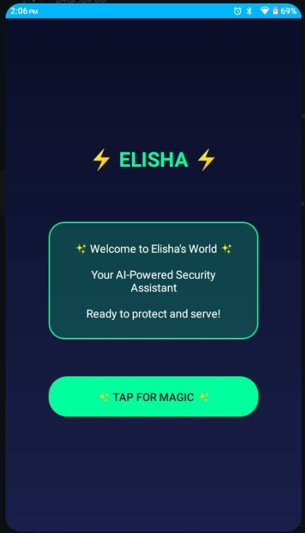
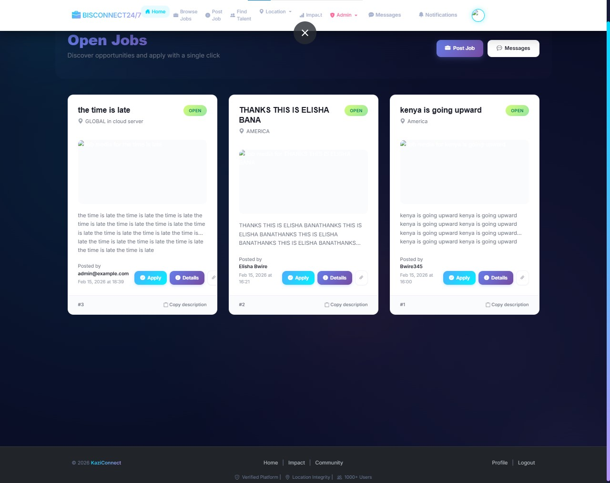
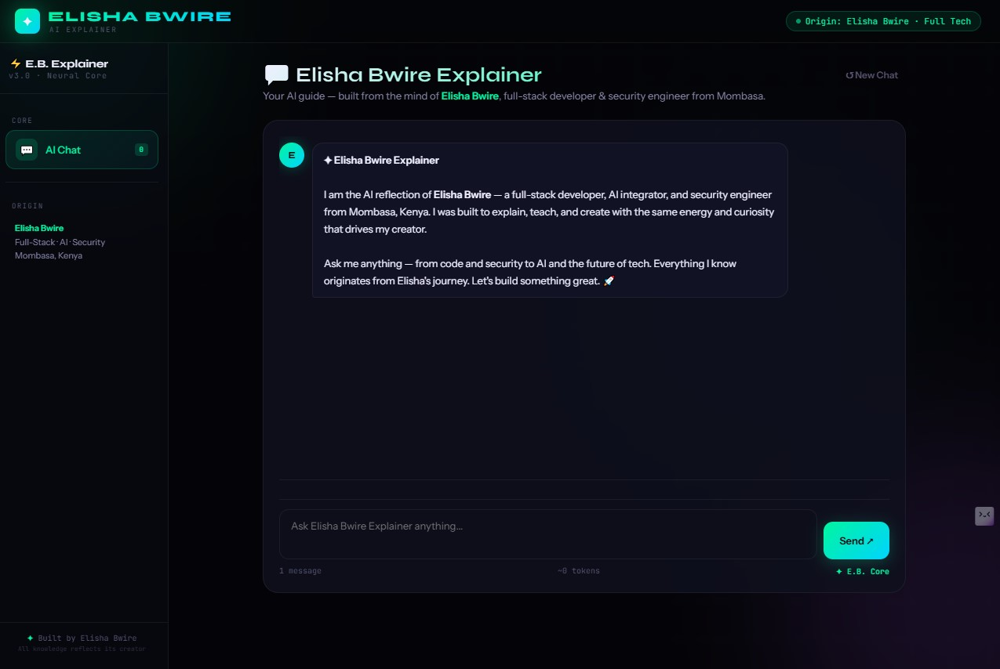

# 🛡️ ELISHA BWIRE

### AI Integration Engineer | Full-Stack Developer | Security-Focused Developer

---

## 👨‍💻 About Me

I'm an **AI Integration Engineer** and **Full-Stack Developer** from **Mombasa, Kenya** with a strong focus on building secure, intelligent applications. My work spans the entire development stack—from Android apps to AI-powered web platforms.

What sets me apart is my ability to integrate AI, web, and mobile technologies into complete end-to-end solutions. I design and build complete software systems by integrating AI, web, mobile, and security technologies into practical real-world solutions.

---

## ⚡ Engineering Highlights

- 🚀 Built and deployed 6+ software projects across web, mobile, and AI
- 🤖 Integrated 12+ AI models including Llama 3.2, Mistral, TinyLlama, and GPT-OSS
- 📱 Developed Android, Web, and AI applications from concept to deployment
- 🖥️ Worked with local (Ollama) and cloud AI deployments
- 🔗 Designed end-to-end systems from frontend to backend
- 🔄 Experience with AI APIs, REST APIs, and model orchestration
- 🌐 Developed and deployed public applications with real users and active engagement
- 🏗️ Built complete software systems independently from planning to deployment

---

## 🎯 Technical Capabilities

| Capability | Experience |
|------------|------------|
| Full-Stack Development | ✅ |
| Android Development | ✅ |
| AI Integration | ✅ |
| REST APIs | ✅ |
| Local LLM Deployment | ✅ |
| Database Design | ✅ |
| Git & GitHub | ✅ |
| Docker | ✅ |
| Secure Development | ✅ |
| Cloud Deployment | ✅ |
| Unit Testing | ✅ |
| System Design | ✅ |

---

## 🔧 Current Focus

- 🧠 Building AI-powered applications with local LLMs
- 🚀 Learning advanced backend architecture and Django best practices
- 🔒 Implementing security-first development practices
- 🤖 Exploring agentic AI systems and multi-model orchestration

---

## 🛠️ Technical Skills

| Category | Skills |
|----------|--------|
| **Languages** | Python, Java, JavaScript, HTML, CSS, SQL |
| **Frameworks & Platforms** | Django, Flask, Android SDK, Gradle, REST APIs |
| **Databases** | SQLite, PostgreSQL, MySQL |
| **Testing** | Unit Testing, Django Testing Framework |
| **AI/ML** | Ollama, Transformers, PyTorch, Pollinations.ai |
| **Cybersecurity** | Malware Analysis, Phishing Detection, Secure Development |
| **DevOps** | Docker, Git, GitHub Actions, Cloudflare |
| **Deployment** | Vercel, Netlify, Cloudflare Pages |

---

## 🚀 Featured Projects

### 🔐 Cybersecurity Dashboard
*AI-Powered Security Analysis Platform*

| Feature | Description |
|---------|-------------|
| **Analysis** | File, URL, image, and chat analysis capabilities |
| **AI Integration** | 12+ AI models (Llama 3.2, Mistral, TinyLlama, GPT-OSS) |
| **Intelligence** | AI assistant with conversation memory |
| **Interface** | Desktop-style responsive UI |

**Tech Stack:** Django, Python, Ollama, JavaScript, HTML, CSS, SQLite

🔗 [View Project](https://github.com/ElishaBwire01/cybersecurity-dashboard)

---

### 🎯 Discipline System
*Personal Productivity and Accountability Platform*

| Feature | Description |
|---------|-------------|
| **Task Management** | Track goals and daily progress |
| **Discipline Metrics** | Measure consistency and habits |
| **User Experience** | Simple and focused productivity workflow |

**Tech Stack:** Python, Django, HTML, CSS, JavaScript, SQLite

🔗 [View Project](https://github.com/ElishaBwire01/-discipline-system)

---

### 📱 Elisha Android App
*Animated Android Application*

| Feature | Description |
|---------|-------------|
| **UI Design** | Gradient UI with custom animations |
| **Interactivity** | Pulsing title, bounce effects, interactive magic button |
| **Design Principles** | Professional Material Design |

**Tech Stack:** Java, Android SDK, Gradle, XML

🔗 [View Project](https://github.com/ElishaBwire01/elisha-android-app)

---

### 💼 Kazi 24/7 - Job Platform
*Connecting Job Seekers with Opportunities*

| Feature | Description |
|---------|-------------|
| **Platform** | Job listing and discovery platform |
| **User Experience** | User-friendly interface |
| **Purpose** | Connecting job seekers with opportunities in Kenya |

**Tech Stack:** HTML, CSS, JavaScript

🔗 [View Project](https://github.com/ElishaBwire01/kazi-24-7)

---

### 🤖 AI Explainer Chat
*Interactive AI Assistant Reflecting Elisha Bwire's Knowledge*

| Feature | Description |
|---------|-------------|
| **AI Persona** | Built as a personal AI reflection of Elisha Bwire |
| **Interface** | Real-time conversational AI interface |
| **Technology** | Powered by Pollinations.ai API |
| **Design** | Tech-animated immersive background |

**Tech Stack:** HTML, CSS, JavaScript, Pollinations.ai API, Vercel

🔗 [Live Demo](https://elisha-ai-explainer.vercel.app) | [View Code](https://github.com/ElishaBwire01)

---

## 🏆 Key Achievements

### 🏗️ Software Engineering
- ✅ Built and maintained 6+ public software projects from concept to deployment
- ✅ Designed applications using MVC architecture with Django
- ✅ Implemented authentication, database management, and API integrations
- ✅ Developed reusable and maintainable codebases using Git version control
- ✅ Designed scalable multi-service architectures integrating AI, databases, and web applications

### 🤖 AI Engineering
- ✅ Integrated 12+ AI models including Llama 3.2, Mistral, TinyLlama, and GPT-OSS into software projects
- ✅ Built local AI systems using Ollama and open-source LLMs
- ✅ Developed AI-powered analysis tools for files, URLs, images, and conversations
- ✅ Created multi-model AI workflows with memory and context handling

### 📱 Android Development
- ✅ Built Android applications using Java, Android SDK, and Gradle
- ✅ Designed responsive mobile interfaces following Material Design principles
- ✅ Generated signed APK builds for deployment and testing
- ✅ Implemented custom animations and interactive UI components

### 🔐 Security Engineering
- ✅ Applied secure coding principles across web and mobile projects
- ✅ Developed security analysis and threat-assessment tools
- ✅ Implemented input validation and secure application practices
- ✅ Researched cybersecurity concepts and defensive security techniques

### ☁️ DevOps & Deployment
- ✅ Deployed applications using Vercel and Cloudflare services
- ✅ Used GitHub Actions for workflow automation
- ✅ Containerized applications with Docker
- ✅ Managed project versioning and collaborative development workflows

### 📈 Professional Strengths
- ✅ Self-taught developer with publicly verifiable projects
- ✅ Experience across AI, web, mobile, and security domains
- ✅ Strong problem-solving and rapid learning ability
- ✅ Proven ability to take projects from idea to working deployment

---

## 📈 Current Learning Focus

- 🚀 Advanced Django Architecture & Best Practices
- 🧠 AI Agent Systems and Multi-Agent Orchestration
- 🐳 Docker & Kubernetes for Production Deployment
- ☁️ Cloud Deployment (AWS, Azure fundamentals)
- 🔒 Advanced Cybersecurity Concepts

---

## 📊 GitHub Analytics

---

## 🌐 Live Projects & Deployment Links

| Project | URL | Status |
|---------|-----|--------|
| **Personal Portfolio** | [elisha-portfolio-five.vercel.app](https://elisha-portfolio-five.vercel.app) | ✅ Live |
| **AI Explainer Chat** | [elisha-ai-explainer.vercel.app](https://elisha-ai-explainer.vercel.app) | ✅ Live |
| **Cybersecurity Dashboard** | [github.com/ElishaBwire01/cybersecurity-dashboard](https://github.com/ElishaBwire01/cybersecurity-dashboard) | 🔧 In Development |
| **Discipline System** | [github.com/ElishaBwire01/-discipline-system](https://github.com/ElishaBwire01/-discipline-system) | ✅ Complete |
| **Elisha Android App** | [github.com/ElishaBwire01/elisha-android-app](https://github.com/ElishaBwire01/elisha-android-app) | ✅ Complete |
| **Kazi 24/7** | [github.com/ElishaBwire01/kazi-24-7](https://github.com/ElishaBwire01/kazi-24-7) | ✅ Complete |

---

## 📫 Professional Contact

| Platform | Details |
|----------|---------|
| **GitHub** | [@ElishaBwire01](https://github.com/ElishaBwire01) |
| **Email** | [elishabwire563@gmail.com](mailto:elishabwire563@gmail.com) |
| **Phone** | [+254 101 277 391](tel:+254101277391) |
| **WhatsApp** | [Chat on WhatsApp](https://wa.me/254101277391) |
| **Portfolio** | [elisha-portfolio-five.vercel.app](https://elisha-portfolio-five.vercel.app) |
| **AI Chat** | [elisha-ai-explainer.vercel.app](https://elisha-ai-explainer.vercel.app) |
| **LinkedIn** | [linkedin.com/in/elishabwire](https://linkedin.com/in/elishabwire) |

---

---

### 🚀 *"Integrating AI, Web, and Mobile into complete solutions"*

---

## 📋 Quick Reference for Recruiters

| Aspect | Details |
|--------|---------|
| **Role** | AI Integration Engineer & Full-Stack Developer |
| **Location** | Mombasa, Kenya |
| **Experience** | Self-Taught Developer with 6+ Public Projects |
| **Core Skills** | Python, Django, Android, Java, AI, Docker, Full-Stack |
| **Projects** | 6+ Real-World Projects with Live Demos |
| **Portfolio** | [elisha-portfolio-five.vercel.app](https://elisha-portfolio-five.vercel.app) |
| **AI Chat** | [elisha-ai-explainer.vercel.app](https://elisha-ai-explainer.vercel.app) |
| **Availability** | Open to Full-time, Internship, and Freelance Opportunities |

---

## 🎯 Seeking Opportunities In

- 💼 Full-Stack Developer
- 🐍 Python Developer
- 📱 Android Developer
- 🤖 AI Integration Engineer
- 🔐 Junior Cybersecurity Analyst
- 🌍 Remote or On-site (Mombasa, Kenya)

---

### 📌 Why Hire Me?

✅ **Real Projects** - My GitHub contains functional, deployed applications you can test immediately.  
✅ **Clean Code** - I write well-documented, maintainable code with best practices.  
✅ **Honest & Transparent** - I'm clear about my experience level and eager to learn.  
✅ **Problem Solver** - I build practical solutions to real-world problems.  
✅ **Continuous Learner** - I'm constantly improving and expanding my skills.  
✅ **Security-Focused** - All my projects are built with security in mind.  
✅ **Full-Stack Versatility** - I integrate AI, web, and mobile technologies into end-to-end solutions.  
✅ **Cross-API Expertise** - I build systems that connect AI models, databases, and frontend interfaces.  

---

*"I design and build complete software systems by integrating AI, web, mobile, and security technologies into practical real-world solutions."*

---

**⭐ Star my repositories if you find my work interesting!**

