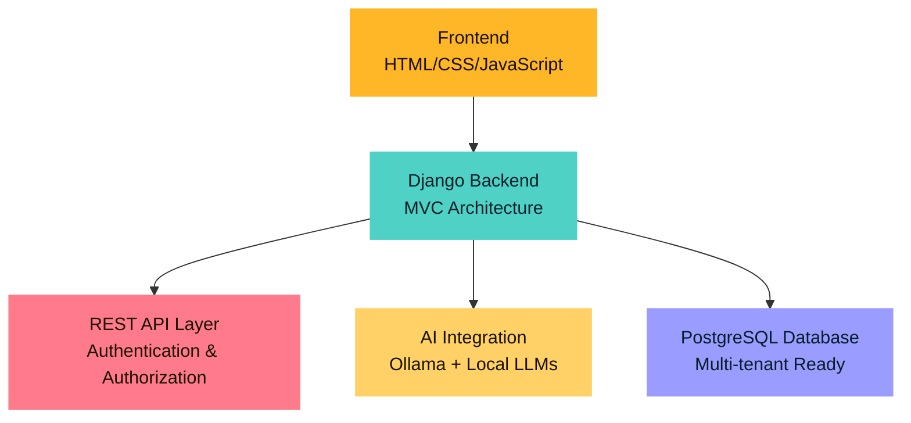
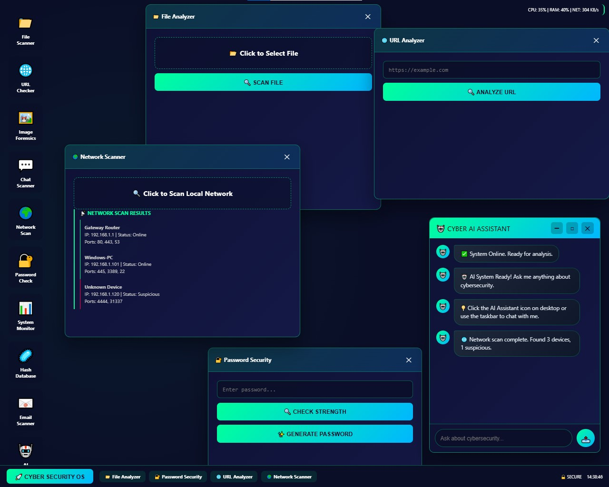
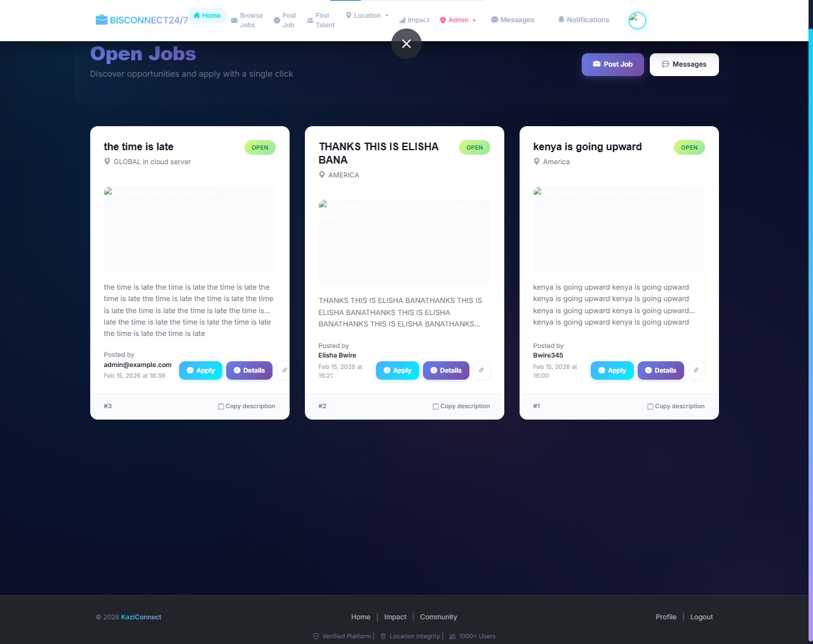
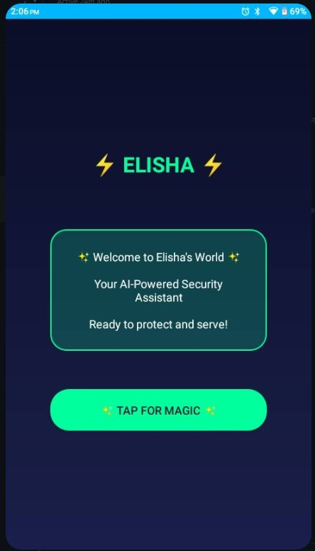
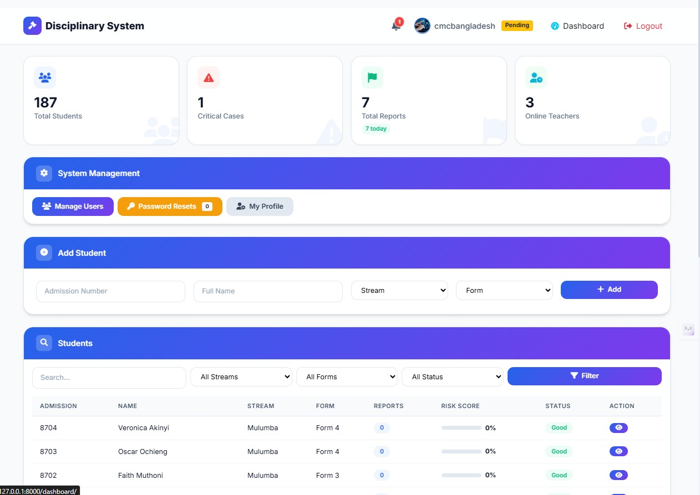
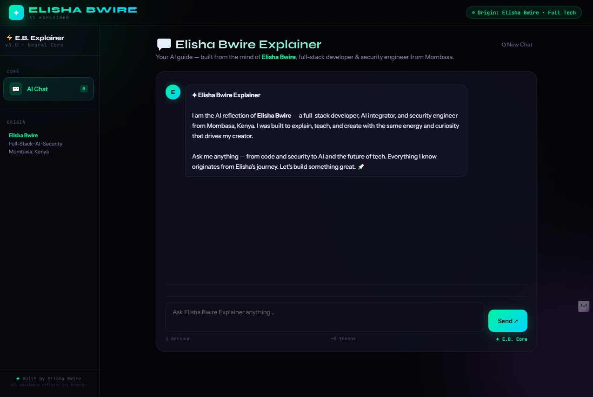
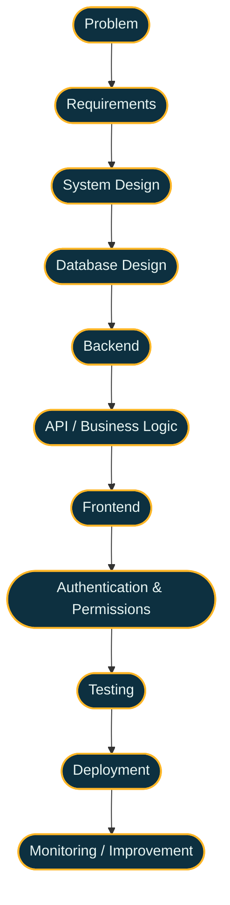
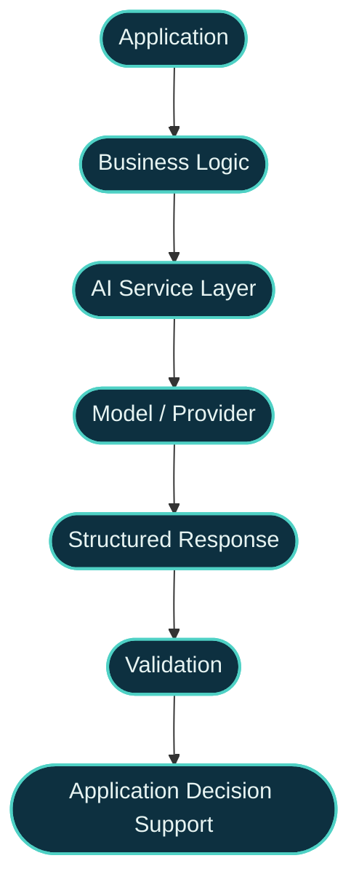
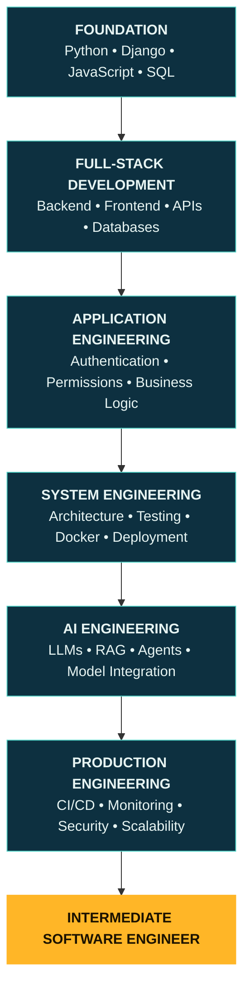

### Junior Full-Stack Software Developer | Python • Django • JavaScript • AI Integration

**Building practical, intelligent software systems through PROBLEM IDENTIFICATION, STAKEHOLDER ANALYSIS, AI-ASSISTED DECISION SUPPORT, USER FEEDBACK, SYSTEM MODULES, INTERVENTION, AND VALUE CREATION.**

> *"Turning real-world problems into practical digital solutions by understanding people, analysing challenges, integrating AI, learning from user feedback, and creating systems that deliver meaningful value."*

  
  
  
  
  
  

  <a href="mailto:elishabwire563@gmail.com">Email</a> •
  <a href="https://wa.me/254101277391">WhatsApp</a> •
  <a href="https://elisha-portfolio-five.vercel.app">Portfolio</a>

## 🛠️ Tech Stack

---

## 🧠 How I Build Software

I don't start with code. **I start with a problem.**

My development process is driven by a practical cycle of understanding real-world challenges, analysing the people and organisations affected, designing the right system, and continuously improving the solution through testing, evidence, and user feedback.

### 🔍 My Problem-to-Value Approach

**PROBLEM IDENTIFICATION → STAKEHOLDER ANALYSIS → AI-ASSISTED DECISION SUPPORT → USER FEEDBACK → SYSTEM MODULES → INTERVENTION → VALUE CREATION**

This means I approach software development by asking:

- 🔎 **What problem exists?** — Identify the real-world challenge before designing the solution.
- 👥 **Who is affected?** — Understand users, stakeholders, workflows, and their different needs.
- 🤖 **Where can AI help?** — Use AI-assisted analysis and decision support where it can provide meaningful value.
- 💬 **What does the user say?** — Learn from clients, users, testing, and real-world feedback.
- 🧩 **What should the system contain?** — Translate requirements into practical modules, features, workflows, databases, and APIs.
- 🎯 **What intervention is needed?** — Design the system to support appropriate actions, follow-up, and measurable outcomes.
- 💡 **What value does it create?** — Continuously evaluate whether the software makes a process easier, more effective, transparent, intelligent, or accessible.

### 🚀 What I'm Building

My projects explore real-world problems across **education, student intelligence, community management, cybersecurity, employment, business, productivity, and mobile applications**.

Two of my current projects demonstrate this approach particularly well:

**🏫 Student Discipline & Intelligence Management**

A school-focused system designed to help authorised stakeholders understand student behaviour and disciplinary patterns more systematically.

It brings together **students, parents, teachers, administrators, discipline committees, structured student profiles, and AI-assisted analysis** to support informed interventions and more effective learning environments.

**🤝 Community Welfare Management**

A community-based platform designed to improve how welfare activities are organised, coordinated, communicated, and managed, with an emphasis on **stakeholder participation, accountability, structured information, and practical digital workflows**.

### 🛠️ My Technical Foundation

| Area | Technologies |
|------|--------------|
| **Backend** | Python • Django • REST APIs |
| **Frontend** | JavaScript • HTML • CSS |
| **Databases** | PostgreSQL • SQLite |
| **AI** | AI Integration • AI-Assisted Analysis |
| **DevOps** | Docker • WSL • Linux |
| **Security** | Authentication • Role-Based Access Control |
| **Data** | Data-Driven Dashboards • Analytics |
| **Mobile** | Android • Java |
| **Development** | Testing • Debugging • System Design • Iteration |

### 🎯 Where I'm Going

My current goal is to grow from a **Junior Full-Stack Software Developer into a strong Intermediate Software Developer** by going beyond simply making applications work.

I am actively developing my understanding of:

**Software Architecture • System Design • Testing • Security • Deployment • Production Engineering • APIs • Database Design • AI Integration • Team Collaboration • Technical Documentation**

My objective is simple:

> **Identify meaningful problems. Understand the people behind them. Build practical systems. Learn from feedback. Improve continuously. Create measurable value.**

### 📋 Recruiter Snapshot

| Aspect | Details |
|--------|---------|
| **Role** | Junior Full-Stack Software Developer • AI Integration |
| **Location** | Mombasa, Kenya |
| **Development Approach** | Problem Identification → Stakeholder Analysis → Solution Design → Implementation → Feedback → Intervention → Value Creation |
| **Core Technologies** | Python • Django • JavaScript • PostgreSQL • REST APIs • Docker • AI • Android |
| **Projects** | Education • Community • Cybersecurity • Employment • Business • Productivity • Mobile |
| **Portfolio** | [elisha-portfolio-five.vercel.app](https://elisha-portfolio-five.vercel.app/) |
| **Availability** | Full-time • Internship • Freelance |

---

### 💭 My Development Philosophy

**I am not interested in building software simply because technology makes it possible.**

I want to understand **why a system is necessary, who it serves, what problem it solves, how it can be improved, and what value it creates.**

That mindset is shaping me not only as a software developer, but also as a **problem solver, systems thinker, and aspiring technology entrepreneur.**
---

## 📋 Quick Reference for Recruiters

| Aspect | Details |
|--------|---------|
| Role | Full-Stack Developer & AI Integration Engineer |
| Location | Mombasa, Kenya |
| Experience | Self-Taught Developer with 6+ Public Projects |
| Core Skills | Python, Django, Android, Java, AI, Docker, Full-Stack |
| Portfolio | [elisha-portfolio-five.vercel.app](https://elisha-portfolio-five.vercel.app) |
| Availability | Open to Full-time, Internship, and Freelance Opportunities |

---

## 🎯 Current Career Focus

I'm currently seeking opportunities where I can contribute as a:

* 💻 Junior Software Developer
* 🌐 Junior Full-Stack Developer
* 🐍 Python / Django Developer
* 🤖 AI Integration Developer
* 🧑‍💻 Software Engineering Intern
* 🚀 Graduate Software Developer

I'm particularly interested in teams where I can work on real products, learn from experienced engineers, contribute to production systems, and continue developing strong software engineering practices.

### 📈 What I'm Looking For

💼 Software Engineering Internships • 🤖 AI Engineering Roles • 🌐 Open Source Collaboration • 🏆 Hackathons • 🎓 Graduate Programs • 💻 Full-Stack Development Roles

---

## 🧠 Core Engineering Skills

| Area                   | Technologies / Skills                                                              |
| ---------------------- | ---------------------------------------------------------------------------------- |
| **Programming**        | Python, JavaScript, Java, HTML, CSS                                                |
| **Backend**            | Django, Django REST Framework, REST APIs, Flask                                    |
| **Frontend**           | HTML, CSS, JavaScript, Responsive UI, Responsive Design                            |
| **Databases**          | PostgreSQL, SQLite, MySQL                                                          |
| **AI Integration**     | Ollama, LLM integration, AI-assisted workflows, Llama 3.2, Mistral, TinyLlama, GPT-OSS |
| **Authentication**     | User authentication, permissions, role-based access                                |
| **DevOps**             | Git, GitHub, Docker, GitHub Actions, Cloudflare, Vercel                            |
| **Cloud / Deployment** | Vercel, Cloudflare, deployment fundamentals, AWS Fundamentals                      |
| **Mobile**             | Java, Android SDK, Gradle, Material Design                                         |
| **Architecture**       | Modular applications, APIs, database-driven systems                                |
| **Development**        | Debugging, refactoring, documentation, system analysis                             |

---

## ⭐ Featured Engineering Projects

My current portfolio is centered around projects that demonstrate progressively more complex software engineering capabilities.

### 🎓 Edu360 Intelligence

**Unified School Management & Student Intelligence Platform**

**Tech:** Python • Django

**Repository:** https://github.com/ElishaBwire01/Edu360-Intelligence

Edu360 Intelligence is a school management and student intelligence platform designed to bring multiple areas of school operations into one system.

> *"An AI-powered School Intelligence Platform that helps educators make faster, more informed, and policy-aware decisions by analyzing school data, identifying at-risk students, and providing actionable recommendations."*

The project combines:

* Academic management
* Student information
* Discipline
* Attendance
* Reporting
* School administration
* Data analysis
* AI-powered insights

<b>Engineering Focus & Why this project matters</b>

 

**Engineering Focus**

* Django backend architecture
* Relational database design
* Authentication and authorization
* Modular application structure
* Data-driven dashboards
* Student intelligence workflows
* AI integration
* Reporting systems
* Scalable application design

**Why this project matters**

This project demonstrates my ability to work on a **multi-domain software system**, rather than only building isolated pages or small applications.

---

### 🧠 Intelligent School Discipline Management

**AI-Assisted Student Discipline & Intelligence System**

**Tech:** Django • Python • SQLite

**Repository:** https://github.com/ElishaBwire01/inteligentschooldisciplnemanagement

This project focuses specifically on school discipline management and the use of software intelligence to help educators understand student behaviour and make better-informed decisions. Helping educators make informed decisions through AI-driven behaviour predictions.

| Feature | Description |
|---------|-------------|
| AI Predictions | Behaviour insights and recommendations |
| Dashboard | Teacher dashboard with student management |
| Administration | School administration and reporting tools |

🔗 [AI School Discipline System](https://github.com/ElishaBwire01/-discipline-system)

<b>Engineering Focus & Development Direction</b>

 

**Engineering Focus**

* Student management
* Discipline records
* Behaviour data
* Administrative workflows
* Intelligence and analytics
* AI-assisted recommendations
* Role-based access
* Reporting
* Django backend development

**Development Direction**

The system is being developed toward a more complete **school intelligence platform**, where historical school data can be analyzed to identify patterns and provide useful decision-support information.

---

### 📚 EduGrade

**School Performance Management Platform**

**Repository:** https://github.com/ElishaBwire01/-EduGrade

EduGrade is a Django-based school performance management platform supporting Kenyan curriculum structures.

The project demonstrates work with:

* Student academic records
* Subject performance
* Grading
* School data
* Academic reporting
* Curriculum-related workflows
* Django applications
* Database-backed systems

**Engineering Focus**

This project provides practical experience working with structured educational data and business rules.

It also demonstrates the ability to work with an existing codebase and extend or adapt software rather than only starting projects from scratch.

---

### 🤝 LakChogo Welfare / Lakchogo Connect

**Community & Welfare Management**

*Helping welfare organizations manage members, finances, and communication with modern AI-powered tools.*

**Tech:** Django • PostgreSQL • Docker • AI • REST APIs • JavaScript

**Status:** 🚧 Active Development | **Release:** 2026

**Repositories:**

* https://github.com/ElishaBwire01/lakchogo_welfare
* https://github.com/ElishaBwire01/lakchogo-connect

LakChogo projects explore software for managing community and welfare organizations.

Core areas include:

* Member management
* Payments
* Meetings
* Welfare records
* Compliance
* Communication
* Reporting
* Authentication
* Organizational workflows

| Feature | Description |
|---------|-------------|
| **Community Management** | Member tracking, communication, and notifications |
| **Finance & Reports** | Financial tracking and reporting tools |
| **Authentication** | Secure member access with role-based permissions |
| **AI Roadmap** | Planned AI-assisted features for community insights |
| **Multi-tenant** | Ready for multiple organizations |

**Engineering Focus**

These projects demonstrate my ability to design software around **real organizational processes**, where different users interact with shared records and business rules.

#### 🏗️ Architecture Diagram

```mermaid
flowchart TD
    A[Frontend<br/>HTML/CSS/JavaScript] --> B[Django Backend<br/>MVC Architecture]
    B --> C[REST API Layer<br/>Authentication & Authorization]
    B --> D[AI Integration<br/>Ollama + Local LLMs]
    B --> E[PostgreSQL Database<br/>Multi-tenant Ready]

    style A fill:#FFB627,color:#1b1200,stroke:#FFB627
    style B fill:#4FD1C5,color:#06202B,stroke:#4FD1C5
    style C fill:#FF7A8A,color:#1b1200,stroke:#FF7A8A
    style D fill:#FFD166,color:#1b1200,stroke:#FFD166
    style E fill:#9A9CFF,color:#06202B,stroke:#9A9CFF
```

---

### 🔐 Cybersecurity Dashboard

**AI-Assisted Security Analysis**

*Helping users analyze files, URLs, and conversations using multiple AI models.*

**Tech:** Django • Python • Ollama • SQLite

**Repository:** https://github.com/ElishaBwire01/cybersecurity-dashboard

A cybersecurity-focused application exploring AI-assisted analysis of digital information.

The project demonstrates work with:

* Django
* Python
* Ollama
* AI models
* File analysis
* URL analysis
* Conversation analysis
* Responsive dashboard interfaces

| Feature | Description |
|---------|-------------|
| Analysis | File, URL, image, and conversation analysis |
| AI Models | 12+ integrated models (Llama 3.2, Mistral, TinyLlama, GPT-OSS) |
| Memory | AI assistant with conversation memory |
| UI | Desktop-style responsive dashboard |

🟢 Live Demo (Coming Soon)

**Engineering Focus**

The project gives me practical experience integrating AI capabilities into a traditional web application rather than treating AI as a completely separate system.

---

### 🏢 Dakesliv

**Business Website & Digital Platform**

**Tech:** TypeScript

**Repository:** https://github.com/ElishaBwire01/dakesliv

A business-oriented web project developed for Dakesliv Group.

This project demonstrates experience outside education and AI-focused applications, including:

* Modern web interfaces
* Business-oriented content
* Responsive design
* TypeScript
* Frontend architecture
* Product/service presentation

---

### 💼 Kazi 24/7

**Employment & Job Discovery Platform**

*Connecting job seekers with employment opportunities in Kenya.*

**Tech:** HTML • CSS • JavaScript

**Repository:** https://github.com/ElishaBwire01/kazi-24-7

A web platform concept focused on connecting job seekers with employment opportunities in Kenya.

**Engineering Focus**

* Frontend development
* Responsive UI
* Job listing workflows
* Information presentation
* User-oriented design

| Feature | Description |
|---------|-------------|
| Platform | Job listing and discovery platform |
| UX | User-friendly interface design |

---

### 📱 Android Applications

**Mobile Development Experience**

*Demonstrating modern Android development with custom animations.*

**Tech:** Java • Android SDK • Gradle

**Repositories:**

* https://github.com/ElishaBwire01/elisha-android-app
* https://github.com/ElishaBwire01/my-android-app

These projects demonstrate experience with:

* Java
* Android SDK
* Gradle
* Mobile UI
* Android application structure
* Custom interface design
* Animation

| Feature | Description |
|---------|-------------|
| UI Design | Gradient UI with custom animations |
| Interactivity | Pulse and bounce effects |
| Design | Professional Material Design principles |

Mobile development is not my primary specialization, but it gives me additional experience understanding software from the client/application side.

---

### 🎯 Discipline System

**Personal productivity and accountability platform**

*Helping individuals track goals and build consistent habits.*

**Tech:** Python • Django • SQLite

| Feature | Description |
|---------|-------------|
| Task Management | Goal tracking and progress monitoring |
| Metrics | Discipline metrics and consistency measurement |
| UX | Simple, focused productivity workflow |

🔗 [Repository](https://github.com/ElishaBwire01/-discipline-system)

---

### 🤖 AI Explainer Chat

**Conversational AI assistant**

*Making AI accessible through conversational interaction.*

**Tech:** HTML • CSS • JavaScript • Pollinations.ai API

| Feature | Description |
|---------|-------------|
| AI Persona | Personal AI reflection of Elisha Bwire |
| Interface | Real-time conversational AI interface |
| Design | Tech-animated immersive background |

🟢 [Live Demo](https://elisha-ai-explainer.vercel.app)
🔗 [Repository](https://github.com/ElishaBwire01/ai-explainer-chat)

---

## 🏗️ Engineering Approach

I don't want my portfolio to be judged only by the number of projects I have created.

I'm increasingly focusing on **how the software is engineered**.

My development approach includes:

```mermaid
flowchart TD
    A([Problem]) --> B([Requirements]) --> C([System Design]) --> D([Database Design]) --> E([Backend]) --> F([API / Business Logic]) --> G([Frontend]) --> H([Authentication & Permissions]) --> I([Testing]) --> J([Deployment]) --> K([Monitoring / Improvement])

    classDef s fill:#0d3040,stroke:#FFB627,color:#E7F4F2,stroke-width:2px
    class A,B,C,D,E,F,G,H,I,J,K s
```

For AI-enabled systems, the architecture extends into:

```mermaid
flowchart TD
    A([Application]) --> B([Business Logic]) --> C([AI Service Layer]) --> D([Model / Provider]) --> E([Structured Response]) --> F([Validation]) --> G([Application Decision Support])

    classDef s fill:#0d3040,stroke:#4FD1C5,color:#E7F4F2,stroke-width:2px
    class A,B,C,D,E,F,G s
```

The goal is to make AI a useful component of the application rather than simply adding a chatbot to a project.

---

## 🧪 Software Engineering Practices I'm Developing

I'm actively strengthening the engineering practices that distinguish a working prototype from maintainable software.

<table>
<tr>
<td valign="top" width="33%">

### Code Quality

* Modular application structure
* Separation of responsibilities
* Reusable components
* Clear naming
* Refactoring
* Documentation

</td>
<td valign="top" width="33%">

### Testing

* Unit testing
* Integration testing
* Django testing
* Regression testing
* Validation of business logic

</td>
<td valign="top" width="33%">

### Security

* Authentication
* Authorization
* Role-based permissions
* Environment variables
* Secret management
* Input validation
* Secure deployment practices

</td>
</tr>
<tr>
<td valign="top" width="33%">

### Database Engineering

* Relational data modelling
* Foreign-key relationships
* Query optimization
* Migrations
* Data integrity
* PostgreSQL development

</td>
<td valign="top" width="33%">

### Deployment

* Git/GitHub workflows
* Docker
* Environment configuration
* Production configuration
* Cloud deployment fundamentals

</td>
<td></td>
</tr>
</table>

---

## 🤖 AI Integration

AI is an important part of my development direction, but I approach it as a **software engineering capability** rather than a replacement for software architecture.

I'm interested in:

* LLM integration
* Local AI models
* Ollama
* AI service layers
* AI-assisted analysis
* RAG
* AI agents
* Multi-agent systems
* Structured AI responses
* AI-assisted decision support
* Model orchestration

My education and school intelligence projects are where I am exploring these concepts most deeply.

---

## ⚡ Engineering Evidence

| 🚀 **6+** | 🤖 **12+** | 📱 **2+** |
|:---:|:---:|:---:|
| public repositories with functional applications | AI models integrated using Ollama | Android applications built with Java and Android SDK |

- 🚀 6+ public repositories with functional applications
- 🤖 12+ AI models integrated using Ollama (Llama 3.2, Mistral, TinyLlama, GPT-OSS)
- "An AI-powered School Intelligence Platform that helps educators make faster, more informed, and policy-aware decisions by analyzing school data, identifying at-risk students, and providing actionable recommendations."
- 📱 2+ Android applications built with Java and Android SDK
- 🖥️ Local (Ollama) and cloud AI deployments
- 🔗 End-to-end system design from frontend to backend
- 🔄 REST API development and model orchestration
- 🐳 Dockerized applications for consistent deployment
- 🔐 Role-based authentication systems
- 📊 Multi-tenant architecture design
- 🌐 Public applications with real users and active engagement

---

## 📊 Selected Engineering Capabilities

Through my projects, I have worked with:

<table>
<tr>
<td valign="top" width="33%">

**Backend**

* Python
* Django
* Django REST Framework
* REST API development
* Business logic
* Authentication
* Permissions

**Frontend**

* HTML
* CSS
* JavaScript
* Responsive interfaces
* Dashboard interfaces

</td>
<td valign="top" width="33%">

**Data**

* PostgreSQL
* SQLite
* MySQL
* Relational modelling
* Database migrations

**AI**

* Ollama
* Local LLMs
* AI application integration
* AI-assisted analysis
* Model orchestration

</td>
<td valign="top" width="33%">

**DevOps**

* Git
* GitHub
* Docker
* GitHub Actions
* Cloud deployment fundamentals

**Mobile**

* Java
* Android SDK
* Gradle

</td>
</tr>
</table>

---

## 📈 Current Development Priorities

Rather than continuously creating new projects, I'm currently focused on making my existing systems more production-oriented.

<b>Priority 1 — Software Quality</b>

* Better tests
* Better error handling
* Cleaner architecture
* Refactoring
* Documentation

<b>Priority 2 — Production Readiness</b>

* Production configuration
* Secure environment management
* PostgreSQL
* Docker
* Deployment
* Logging
* Monitoring

<b>Priority 3 — API Engineering</b>

* REST API design
* Authentication
* Validation
* Permissions
* API documentation

<b>Priority 4 — AI Engineering</b>

* Reliable AI service architecture
* Structured outputs
* Model abstraction
* RAG
* AI agents
* Evaluation
* Guardrails

<b>Priority 5 — Professional Engineering</b>

* Git workflows
* Pull requests
* Code review
* Issue tracking
* Team collaboration
* Open-source contribution

---

## 🚀 What I'm Building & Learning

My most active development direction is centered around **intelligent education software**.

The main progression is:

```mermaid
flowchart LR
    A([EduGrade]) --> B([School Data Management]) --> C([Discipline Management]) --> D([Student Intelligence]) --> E([Edu360 Intelligence]) --> F([AI-Assisted School Decision Support])

    classDef s fill:#0d3040,stroke:#FFB627,color:#E7F4F2,stroke-width:2px
    class A,B,C,D,E,F s
```

This progression represents an important part of my development journey: moving from individual application features toward larger, integrated software systems.

**Currently Building:**

* 🤝 **Lakchogo Connect** — AI-powered community & welfare management platform
* 🔐 **Cybersecurity Dashboard** — AI-assisted threat intelligence platform
* 🎓 **AI School Discipline System** — Behaviour prediction and recommendations

**Currently Learning:**

I'm continuously developing my knowledge in:

* Advanced Django
* Django REST Framework
* PostgreSQL
* Docker & Kubernetes
* CI/CD
* Cloud deployment (AWS, Azure)
* Software architecture
* Automated testing
* AI Agents & Multi-Agent Systems
* RAG, MCP, and LangChain
* LLM application engineering
* System design

---

## 🌍 Problem Domains

My projects have given me practical exposure to different domains:

| Domain           | Project Experience                                  |
| ---------------- | --------------------------------------------------- |
| 🎓 Education     | Edu360, EduGrade, Discipline Systems                |
| 🤖 AI            | School Intelligence, Cybersecurity, AI applications |
| 🤝 Community     | LakChogo Welfare                                    |
| 🔐 Cybersecurity | Cybersecurity Dashboard                             |
| 💼 Employment    | Kazi 24/7                                           |
| 🏢 Business      | Dakesliv                                            |
| 📱 Mobile        | Android Applications                                |
| 🎯 Productivity  | Discipline / accountability applications            |

This gives me experience translating different real-world requirements into software concepts.

---

## 📌 Portfolio Philosophy

I believe the strongest developer portfolio is not the one with the largest number of repositories.

It is the one where someone can open a project and see:

```mermaid
flowchart LR
    A([A real problem]) --> B([A clear solution]) --> C([Thoughtful architecture]) --> D([Working implementation]) --> E([Tests]) --> F([Documentation]) --> G([Deployment]) --> H([Continuous improvement])

    classDef s fill:#0d3040,stroke:#4FD1C5,color:#E7F4F2,stroke-width:2px
    class A,B,C,D,E,F,G,H s
```

That is the standard I am working toward across my projects.

---

## 🎯 Career Goal

My immediate goal is to join a professional software engineering environment where I can:

* Work with experienced developers
* Contribute to production software
* Learn professional development workflows
* Participate in code reviews
* Improve system design skills
* Strengthen testing practices
* Work with APIs and databases
* Build scalable applications
* Develop reliable AI integrations
* Contribute to a real engineering team

My long-term goal is to become a highly capable software engineer who can design and build complete intelligent systems from requirements through production.

---

## 📂 Repository Portfolio

### ⭐ Current / Primary Projects

| Project                                      | Focus                             | Technology      |
| -------------------------------------------- | --------------------------------- | --------------- |
| **[Edu360 Intelligence](https://github.com/ElishaBwire01/Edu360-Intelligence)** | School management & intelligence  | Python / Django |
| **[Intelligent School Discipline Management](https://github.com/ElishaBwire01/inteligentschooldisciplnemanagement)** | Student discipline & intelligence | Python / Django |
| **[EduGrade](https://github.com/ElishaBwire01/-EduGrade)** | Academic management               | Python / Django |
| **[LakChogo Welfare](https://github.com/ElishaBwire01/lakchogo_welfare)** | Community welfare management      | Python / Django |
| **[Dakesliv](https://github.com/ElishaBwire01/dakesliv)** | Business platform                 | TypeScript      |

### 🛠️ Additional Projects

| Project                     | Focus                         |
| --------------------------- | ----------------------------- |
| **[Cybersecurity Dashboard](https://github.com/ElishaBwire01/cybersecurity-dashboard)** | AI-assisted security analysis |
| **[Discipline System](https://github.com/ElishaBwire01/-discipline-system)** | Productivity & accountability |
| **[Kazi 24/7](https://github.com/ElishaBwire01/kazi-24-7)** | Employment platform |
| **[Elisha Android App](https://github.com/ElishaBwire01/elisha-android-app)** | Android development |
| **[My Android App](https://github.com/ElishaBwire01/my-android-app)** | Android development |

### ⭐ Recommended Repositories

| Repository | Description |
|------------|-------------|
| **[Lakchogo Connect](https://github.com/ElishaBwire01/lakchogo-connect)** | AI-powered community & welfare management platform |
| **[Cybersecurity Dashboard](https://github.com/ElishaBwire01/cybersecurity-dashboard)** | AI-powered security analysis with 12+ models |
| **[AI Explainer Chat](https://github.com/ElishaBwire01/ai-explainer-chat)** | Conversational AI assistant |
| **[Discipline System](https://github.com/ElishaBwire01/-discipline-system)** | Personal productivity and accountability platform |
| **[Elisha Android App](https://github.com/ElishaBwire01/elisha-android-app)** | Modern Android app with custom animations |

---

## 🌐 Live & Online Presence

### Portfolio

https://elisha-portfolio-five.vercel.app

### LinkedIn

https://www.linkedin.com/in/elisha-bwire-a4a508315

### GitHub

https://github.com/ElishaBwire01

### AI Explainer

https://elisha-ai-explainer.vercel.app

### Email

[elishabwire563@gmail.com](mailto:elishabwire563@gmail.com)

### 🌐 Live Projects

| Project | URL | Status |
|---------|-----|--------|
| Portfolio | [elisha-portfolio-five.vercel.app](https://elisha-portfolio-five.vercel.app) | ✅ Live |
| AI Explainer | [elisha-ai-explainer.vercel.app](https://elisha-ai-explainer.vercel.app) | ✅ Live |
| Cybersecurity Dashboard | [github.com/ElishaBwire01/cybersecurity-dashboard](https://github.com/ElishaBwire01/cybersecurity-dashboard) | 🔧 Dev |
| Discipline System | [github.com/ElishaBwire01/-discipline-system](https://github.com/ElishaBwire01/-discipline-system) | ✅ Complete |
| Android App | [github.com/ElishaBwire01/elisha-android-app](https://github.com/ElishaBwire01/elisha-android-app) | ✅ Complete |
| Kazi 24/7 | [github.com/ElishaBwire01/kazi-24-7](https://github.com/ElishaBwire01/kazi-24-7) | ✅ Complete |

---

## 🧭 Development Roadmap

```mermaid
flowchart TD
    A["<b>FOUNDATION</b><br/>Python • Django • JavaScript • SQL"] --> B["<b>FULL-STACK DEVELOPMENT</b><br/>Backend • Frontend • APIs • Databases"]
    B --> C["<b>APPLICATION ENGINEERING</b><br/>Authentication • Permissions • Business Logic"]
    C --> D["<b>SYSTEM ENGINEERING</b><br/>Architecture • Testing • Docker • Deployment"]
    D --> E["<b>AI ENGINEERING</b><br/>LLMs • RAG • Agents • Model Integration"]
    E --> F["<b>PRODUCTION ENGINEERING</b><br/>CI/CD • Monitoring • Security • Scalability"]
    F --> G["<b>INTERMEDIATE SOFTWARE ENGINEER</b>"]

    style A fill:#0d3040,stroke:#4FD1C5,color:#E7F4F2
    style B fill:#0d3040,stroke:#4FD1C5,color:#E7F4F2
    style C fill:#0d3040,stroke:#4FD1C5,color:#E7F4F2
    style D fill:#0d3040,stroke:#4FD1C5,color:#E7F4F2
    style E fill:#0d3040,stroke:#4FD1C5,color:#E7F4F2
    style F fill:#0d3040,stroke:#4FD1C5,color:#E7F4F2
    style G fill:#FFB627,stroke:#FFB627,color:#1b1200
```

---

## 🌍 My Vision

To establish a software company that develops intelligent digital solutions for healthcare, education, community welfare, churches, finance, agriculture, government, and NGOs — using AI, cloud technologies, mobile applications, and secure software engineering.

---

## 🏆 Hackathons

**Current:** Build with Gemini XPRIZE • ML Empowerment Build Challenge 2.0

**Interested in:** AI • Open Source • Team Collaboration • Building impactful solutions

---

## 🤝 Open To

I'm open to:

* Junior Software Developer opportunities
* Junior Full-Stack Developer roles
* Python / Django opportunities
* Software Engineering internships
* Graduate developer programs
* AI integration opportunities
* Open-source collaboration
* Hackathons
* Software development collaborations

---

## 📊 GitHub Analytics

---

## 📫 Connect With Me

| Platform | Details |
|----------|---------|
| GitHub | @ElishaBwire01 |
| Email | [elishabwire563@gmail.com](mailto:elishabwire563@gmail.com) |
| WhatsApp | [Chat on WhatsApp](https://wa.me/254101277391) |
| Portfolio | [elisha-portfolio-five.vercel.app](https://elisha-portfolio-five.vercel.app) |
| LinkedIn | [linkedin.com/in/elisha-bwire](https://www.linkedin.com/in/elisha-bwire-a4a508315) |

🚀 "Integrating AI, Web, and Mobile into complete solutions"

---

## 📌 Why Hire Me?

- ✅ **Real Projects** — Functional, deployed applications you can test immediately
- ✅ **Clean Code** — Well-documented, maintainable code with best practices
- ✅ **Problem Solver** — Practical solutions to real-world problems
- ✅ **Continuous Learner** — Constantly improving and expanding skills
- ✅ **Security-Focused** — All projects built with security in mind

---

## ☕ Fun Facts

- 💡 I enjoy solving real-world problems
- 🌍 I dream of building software used across Africa
- 🤖 I enjoy experimenting with AI models
- 📚 I'm always learning something new
- 🤝 I enjoy collaborating with developers

---

## 📌 A Final Thought

> "Great software isn't measured by the number of features it has, but by the number of lives it improves."

---

## 💬 Let's Build

I'm interested in building useful software, learning from other engineers, contributing to meaningful projects, and growing through real-world engineering challenges.

If you're interested in software development, AI integration, education technology, community technology, or open-source collaboration, feel free to connect.

### 🤝 Let's Build Together

Interested in AI, full-stack development, or technology for communities? I'm always open to collaborating on impactful projects, internships, hackathons, and open-source initiatives. Let's build something meaningful together.

⭐ Star my repositories if you find my work interesting!

### 🚀 Build. Learn. Improve. Ship.

**Elisha Bwire — Full-Stack Software Developer**

