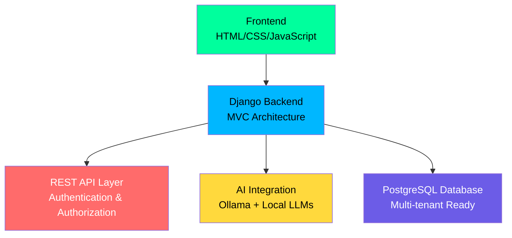

# 🛡️ ELISHA BWIRE

### Full-Stack Developer | AI Integration • Building Technology for Communities

> *"Building intelligent software that solves real-world problems for communities across Africa."*

---

## 🛠️ Tech Stack

---

## 👋 About Me

Hello! I'm **Elisha Bwire**, a self-taught **Full-Stack Developer** and **AI Integration Engineer** based in **Mombasa, Kenya**. I build technology that solves real-world problems and creates meaningful impact for communities.

I've independently built projects ranging from AI-powered platforms and community management systems to education, productivity, cybersecurity, and employment solutions. I'm particularly passionate about integrating AI into everyday software — exploring how intelligent systems can assist decision-making, automate repetitive work, and improve organizational operations.

---

## ⭐ Recommended Repositories

| Repository | Description |
|------------|-------------|
| **[Lakchogo Connect](https://github.com/ElishaBwire01/lakchogo-connect)** | AI-powered community & welfare management platform |
| **[Cybersecurity Dashboard](https://github.com/ElishaBwire01/cybersecurity-dashboard)** | AI-powered security analysis with 12+ models |
| **[AI Explainer Chat](https://github.com/ElishaBwire01/ai-explainer-chat)** | Conversational AI assistant |
| **[Discipline System](https://github.com/ElishaBwire01/-discipline-system)** | Personal productivity and accountability platform |
| **[Elisha Android App](https://github.com/ElishaBwire01/elisha-android-app)** | Modern Android app with custom animations |

---

## 🚀 What I'm Building & Learning

**Currently Building:**
- 🤝 **Lakchogo Connect** — AI-powered community & welfare management platform
- 🔐 **Cybersecurity Dashboard** — AI-assisted threat intelligence platform
- 🎓 **AI School Discipline System** — Behaviour prediction and recommendations

**Currently Learning:**
- 🧠 AI Agents & Multi-Agent Systems
- 🐳 Docker & Kubernetes
- 🔗 RAG, MCP, and LangChain
- ☁️ Cloud Deployment (AWS, Azure)

---

## 🌟 Featured Project

### 🤝 Lakchogo Connect

*Helping welfare organizations manage members, finances, and communication with modern AI-powered tools.*

**Tech:** Django • PostgreSQL • Docker • AI • REST APIs • JavaScript

| Feature | Description |
|---------|-------------|
| **Community Management** | Member tracking, communication, and notifications |
| **Finance & Reports** | Financial tracking and reporting tools |
| **Authentication** | Secure member access with role-based permissions |
| **AI Roadmap** | Planned AI-assisted features for community insights |
| **Multi-tenant** | Ready for multiple organizations |

**Status:** 🚧 Active Development | **Release:** 2026

🔗 **[Repository](https://github.com/ElishaBwire01/lakchogo-connect)**

---

### 🏗️ Architecture Diagram

```mermaid
flowchart TD
    A[Frontend<br/>HTML/CSS/JavaScript] --> B[Django Backend<br/>MVC Architecture]
    B --> C[REST API Layer<br/>Authentication & Authorization]
    B --> D[AI Integration<br/>Ollama + Local LLMs]
    B --> E[PostgreSQL Database<br/>Multi-tenant Ready]

    style A fill:#00ff9d,color:#000
    style B fill:#00b7ff,color:#000
    style C fill:#ff6b6b,color:#fff
    style D fill:#ffd93d,color:#000
    style E fill:#6c5ce7,color:#fff
```

---

## 🚀 Featured Projects

### 🔐 Cybersecurity Dashboard

Helping users analyze files, URLs, and conversations using multiple AI models.

**Tech:** Django • Ollama • SQLite

| Feature | Description |
|---------|-------------|
| Analysis | File, URL, image, and conversation analysis |
| AI Models | 12+ integrated models (Llama 3.2, Mistral, TinyLlama, GPT-OSS) |
| Memory | AI assistant with conversation memory |
| UI | Desktop-style responsive dashboard |

🟢 Live Demo (Coming Soon)
🔗 [Repository](https://github.com/ElishaBwire01/cybersecurity-dashboard)

---

### 🎓 AI School Discipline System

Helping educators make informed decisions through AI-driven behaviour predictions.

**Tech:** Django • Python • SQLite

| Feature | Description |
|---------|-------------|
| AI Predictions | Behaviour insights and recommendations |
| Dashboard | Teacher dashboard with student management |
| Administration | School administration and reporting tools |

🔗 [Repository](https://github.com/ElishaBwire01/-discipline-system)

---

### 🎯 Discipline System

Helping individuals track goals and build consistent habits.

**Tech:** Python • Django • SQLite

| Feature | Description |
|---------|-------------|
| Task Management | Goal tracking and progress monitoring |
| Metrics | Discipline metrics and consistency measurement |
| UX | Simple, focused productivity workflow |

🔗 [Repository](https://github.com/ElishaBwire01/-discipline-system)

---

### 📱 Elisha Android App

Demonstrating modern Android development with custom animations.

**Tech:** Java • Android SDK • Gradle

| Feature | Description |
|---------|-------------|
| UI Design | Gradient UI with custom animations |
| Interactivity | Pulse and bounce effects |
| Design | Professional Material Design principles |

🔗 [Repository](https://github.com/ElishaBwire01/elisha-android-app)

---

### 💼 Kazi 24/7 Job Platform

Connecting job seekers with employment opportunities in Kenya.

**Tech:** HTML • CSS • JavaScript

| Feature | Description |
|---------|-------------|
| Platform | Job listing and discovery platform |
| UX | User-friendly interface design |

🔗 [Repository](https://github.com/ElishaBwire01/kazi-24-7)

---

### 🤖 AI Explainer Chat

Making AI accessible through conversational interaction.

**Tech:** HTML • CSS • JavaScript • Pollinations.ai API

| Feature | Description |
|---------|-------------|
| AI Persona | Personal AI reflection of Elisha Bwire |
| Interface | Real-time conversational AI interface |
| Design | Tech-animated immersive background |

🟢 [Live Demo](https://elisha-ai-explainer.vercel.app)
🔗 [Repository](https://github.com/ElishaBwire01/ai-explainer-chat)

---

## ⚡ Engineering Evidence

- 🚀 6+ public repositories with functional applications
- 🤖 12+ AI models integrated using Ollama (Llama 3.2, Mistral, TinyLlama, GPT-OSS)
- 📱 2+ Android applications built with Java and Android SDK
- 🖥️ Local (Ollama) and cloud AI deployments
- 🔗 End-to-end system design from frontend to backend
- 🔄 REST API development and model orchestration
- 🐳 Dockerized applications for consistent deployment
- 🔐 Role-based authentication systems
- 📊 Multi-tenant architecture design
- 🌐 Public applications with real users and active engagement

---

## 🎯 Technical Skills

| Category | Technologies |
|----------|-------------|
| Backend | Django, Flask, REST APIs, Django REST Framework |
| AI Integration | Ollama, Llama 3.2, Mistral, TinyLlama, GPT-OSS |
| Frontend | HTML, CSS, JavaScript, Responsive Design |
| Android | Java, Android SDK, Gradle, Material Design |
| DevOps | Docker, Git, GitHub Actions, Cloudflare, Vercel |
| Databases | PostgreSQL, MySQL, SQLite |
| Cloud | Vercel, Cloudflare, AWS Fundamentals |

---

## 🌍 My Vision

To establish a software company that develops intelligent digital solutions for healthcare, education, community welfare, churches, finance, agriculture, government, and NGOs — using AI, cloud technologies, mobile applications, and secure software engineering.

---

## 🏆 Hackathons

**Current:** Build with Gemini XPRIZE • ML Empowerment Build Challenge 2.0

**Interested in:** AI • Open Source • Team Collaboration • Building impactful solutions

---

## 📈 What I'm Looking For

💼 Software Engineering Internships • 🤖 AI Engineering Roles • 🌐 Open Source Collaboration • 🏆 Hackathons • 🎓 Graduate Programs • 💻 Full-Stack Development Roles

---

## 📊 GitHub Analytics

https://github-readme-activity-graph.vercel.app/graph?username=ElishaBwire01&theme=react-dark

https://github-profile-trophy.vercel.app/?username=ElishaBwire01&theme=darkhub&no-frame=true&row=1

---

## 🌐 Live Projects

| Project | URL | Status |
|---------|-----|--------|
| Portfolio | [elisha-portfolio-five.vercel.app](https://elisha-portfolio-five.vercel.app) | ✅ Live |
| AI Explainer | [elisha-ai-explainer.vercel.app](https://elisha-ai-explainer.vercel.app) | ✅ Live |
| Cybersecurity Dashboard | [github.com/ElishaBwire01/cybersecurity-dashboard](https://github.com/ElishaBwire01/cybersecurity-dashboard) | 🔧 Dev |
| Discipline System | [github.com/ElishaBwire01/-discipline-system](https://github.com/ElishaBwire01/-discipline-system) | ✅ Complete |
| Android App | [github.com/ElishaBwire01/elisha-android-app](https://github.com/ElishaBwire01/elisha-android-app) | ✅ Complete |
| Kazi 24/7 | [github.com/ElishaBwire01/kazi-24-7](https://github.com/ElishaBwire01/kazi-24-7) | ✅ Complete |

---

## 📫 Connect With Me

| Platform | Details |
|----------|---------|
| GitHub | @ElishaBwire01 |
| Email | [elishabwire563@gmail.com](mailto:elishabwire563@gmail.com) |
| WhatsApp | [Chat on WhatsApp](https://wa.me/254101277391) |
| Portfolio | [elisha-portfolio-five.vercel.app](https://elisha-portfolio-five.vercel.app) |
| LinkedIn | [linkedin.com/in/elisha-bwire](https://www.linkedin.com/in/elisha-bwire-a4a508315) |

🚀 "Integrating AI, Web, and Mobile into complete solutions"

---

## 📋 Quick Reference for Recruiters

| Aspect | Details |
|--------|---------|
| Role | Full-Stack Developer & AI Integration Engineer |
| Location | Mombasa, Kenya |
| Experience | Self-Taught Developer with 6+ Public Projects |
| Core Skills | Python, Django, Android, Java, AI, Docker, Full-Stack |
| Portfolio | [elisha-portfolio-five.vercel.app](https://elisha-portfolio-five.vercel.app) |
| Availability | Open to Full-time, Internship, and Freelance Opportunities |

---

## 📌 Why Hire Me?

- ✅ Real Projects — Functional, deployed applications you can test immediately
- ✅ Clean Code — Well-documented, maintainable code with best practices
- ✅ Problem Solver — Practical solutions to real-world problems
- ✅ Continuous Learner — Constantly improving and expanding skills
- ✅ Security-Focused — All projects built with security in mind

---

## ☕ Fun Facts

- 💡 I enjoy solving real-world problems
- 🌍 I dream of building software used across Africa
- 🤖 I enjoy experimenting with AI models
- 📚 I'm always learning something new
- 🤝 I enjoy collaborating with developers

---

## 📌 A Final Thought

"Great software isn't measured by the number of features it has, but by the number of lives it improves."

---

## 🤝 Let's Build Together

Interested in AI, full-stack development, or technology for communities? I'm always open to collaborating on impactful projects, internships, hackathons, and open-source initiatives. Let's build something meaningful together.

⭐ Star my repositories if you find my work interesting!

---

